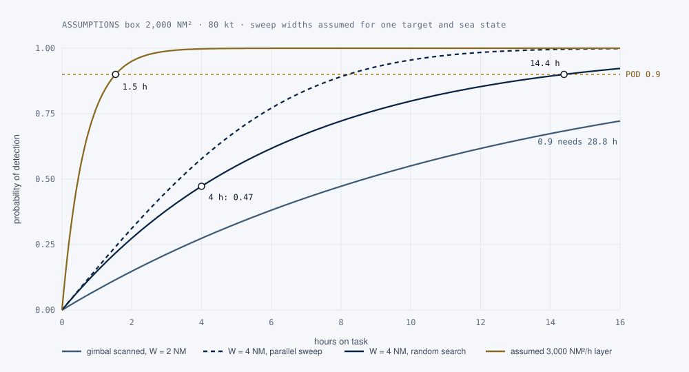

<p align="center">
  
</p>

## What this is

A small, tested Python package and field notes on the mathematics of wide-area search for intelligence, surveillance and reconnaissance: effective sweep width, coverage rate, Koopman's random-search law, parallel and exhaustive search, cross-cueing, track persistence and re-search time, and the false-alarm burden a search layer puts on its operators. A command line interface computes probability of detection for a search box and writes POD-versus-time curves as CSV, and as a PNG when matplotlib is installed.

## Why it matters

Maritime surveillance, border patrol and search and rescue are dominated by search: few targets, large areas, little time. The number a mission commander needs is not sensor range but probability of detection: "after four hours we have a 47% chance of having found the boat, if it is in this box". Search theory turns a sensor argument into a mission argument, and it is the honest way to compare architectures: same box, same hours, which POD? It also exposes the two places where multi-sensor suites quietly lose their value: the cue between a search sensor and an identification sensor, and the gaps in which a held track becomes a new search.

<p align="center">
  
</p>
<p align="center"><sub><b>Figure 1.</b> The chain from search to track. A candidate earns attention in the alert queue, is cross-cued to a narrow sensor, identified and held. When contact is lost, the uncertainty area grows with the square of the gap and the chain returns to search.</sub></p>

## Quick start

```bash
git clone https://github.com/darkanalytica1/isr-search-theory
cd isr-search-theory
python -m isrsearch plan --area 2000 --sweep-width 4 --speed 80 --hours 4
python -m isrsearch curve --area 2000 --sweep-width 4 --speed 80 --hours 16 --out out/pod
python -m isrsearch reacquire --target-speed 20 --gap-min 15 30 --sweep-width 2 --speed 80
python -m isrsearch burden --candidates 50000 --pfa 0.001 --targets 2 --pd 0.8 --review-s 20
```

```text
$ python -m isrsearch plan --area 2000 --sweep-width 4 --speed 80 --hours 4
area              2,000 NM^2
sweep width       4 NM (assumed for target and conditions)
speed             80 kt  ->  320 NM^2/h
time on task      4 h  ->  track 320 NM
coverage factor   C = 0.64
POD random        0.47
POD parallel      0.58
hours for POD 0.9 (random)  14.4
```

`curve` always writes `out/pod.csv`; with `pip install matplotlib` it also writes `out/pod.png`. Add `--alt-rate 3000` to overlay an assumed area rate.

From Python:

```python
from isrsearch import SearchPlan, reacquire, alert_burden, cue_time, cue_error_radius

plan = SearchPlan(area_nm2=2000, sweep_width_nm=4, speed_kt=80)
plan.pod(4)                 # 0.473
plan.pod(4, "parallel")     # 0.578
plan.hours_for(0.9)         # 14.39

reacquire(0.9, target_speed_kt=20, gap_h=0.5, sweep_width_nm=2, searcher_speed_kt=80).hours  # 4.52
alert_burden(50_000, 0.001, 2, 0.8, 20).ppv                                                   # 0.031
cue_time(cue_error_radius(150, 10, 10), footprint_width_m=175, scan_speed_m_s=100).dominant    # 'search'
```

## Method

| Quantity | Formula | Worked example (tested) |
|---|---|---|
| Staring footprint | w = 2R·tan(FOV/2) | 2° at 5 km → 175 m; 7.5 NM²/h at 80 kt |
| Coverage rate | Ȧ = W·v | W 2 NM at 80 kt → 160 NM²/h |
| Coverage factor | C = W·L / A | 4 NM × 320 NM / 2,000 NM² → 0.64 |
| Random search | POD = 1 − exp(−C) | 0.47 after 4 h |
| Parallel sweep | POD ≈ erf(√π·C/2) | 0.58 after 4 h |
| Effort for a POD | L = −ln(1 − POD)·A / W | POD 0.9 → 1,151 NM, 14.4 h |
| Re-search after a gap | A = π(v·t)²; t ≈ −ln(1 − POD)·A / (W·v) | 15 min → 1.13 h; 30 min → 4.5 h |
| Alert burden | PPV = N_t·Pd / (N_t·Pd + N_c·Pfa) | 50,000 candidates, Pfa 0.001 → PPV 0.031, 17 min/h |

<p align="center">
  
</p>
<p align="center"><sub><b>Figure 2.</b> POD against time in the same box. The gap between 28.8 hours and 1.5 hours to reach POD 0.9 is the whole case for a wide-area layer, and it rests entirely on whether the assumed sweep width holds for the target and sea state.</sub></p>

Full notes, including sweep width, cueing, persistence, operator burden and a decision guide for the next ISR investment, are in [docs/METHOD.md](docs/METHOD.md).

## Limitations and assumptions

- **Sweep width is an input, not an output.** Every POD depends on a W defined for one sensor, target, altitude and environment. The examples use assumed values. Measure or look up W for the case at hand.
- **POD is conditional** on the target being in the box. It does not include probability of area.
- **Stationary targets.** The search laws assume the target does not move out of the box during the search. The re-search model also ignores that the uncertainty area keeps growing while the re-search runs, so it is optimistic for long re-searches.
- **Independence and uniform effort.** Random search assumes effort is spread uniformly with random overlap; parallel sweep assumes accurate lane spacing and navigation. Real searches sit between them.
- **The cueing and sensor value models** are first-order analytical aids by the author for ranking options under the same assumptions. They are not performance models of any sensor.
- **No published product figure** is used as a planning constant. A quoted area rate without its target, speed and detection probability is a claim to be characterised.

## Tests

```bash
pip install -r requirements.txt
python -m pytest -q
```

Python 3.10+. No runtime dependencies; matplotlib is optional. The CSV fallback is tested with matplotlib hidden. Tests run on GitHub Actions for Python 3.10 to 3.13.

## Sources

Koopman (1946, 1980), Stone (1989), Washburn (2014), Frost (1999), the IAMSAR Manual Volume II, Swets (1996), Bar-Shalom, Willett and Tian (2011), Blackman and Popoli (1999) and Johnson (1958). Full list in [docs/SOURCES.md](docs/SOURCES.md).

## Licence

MIT. See [LICENSE](LICENSE).

<sub>DarkAnalytica · educational material from public sources and original synthesis.</sub>
